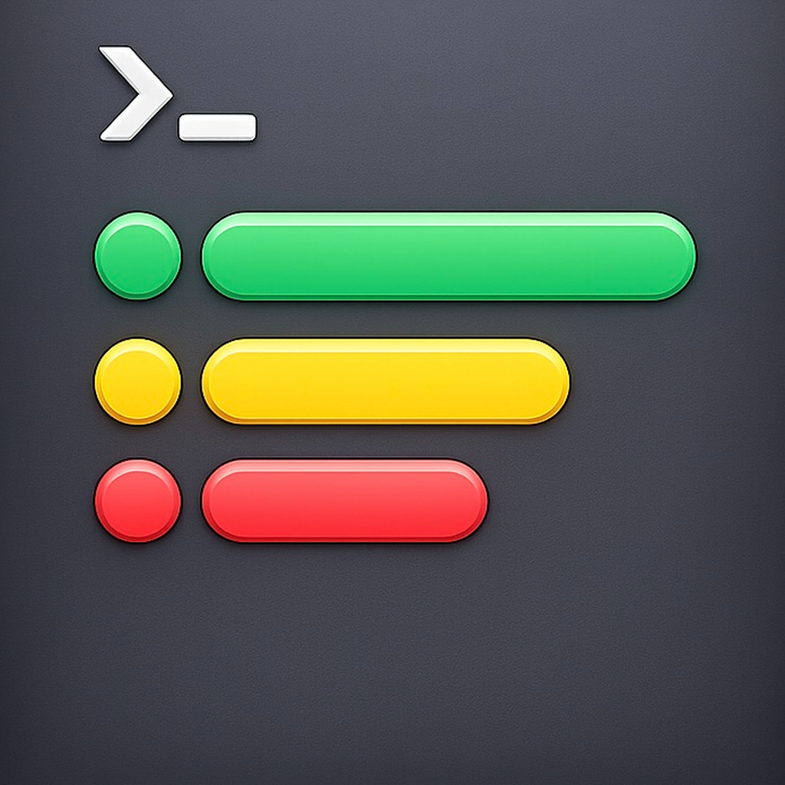
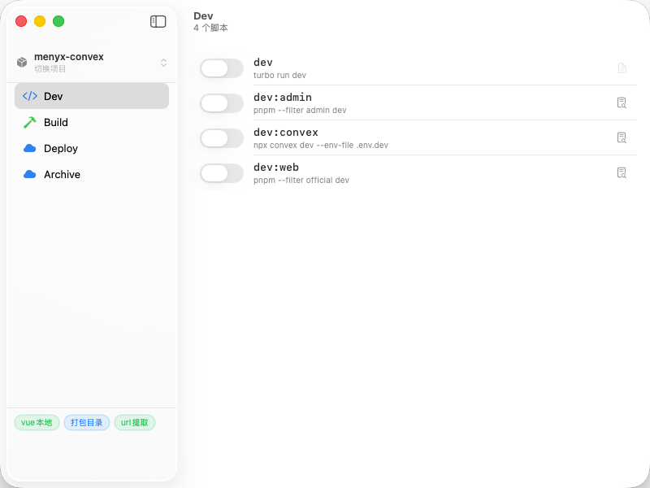

<div align="center">
  

  # Depot

  **A native macOS process manager for pnpm / npm monorepos.**

  Run, monitor, and control all your workspace scripts from a single panel — without opening a terminal.

  
  
  

</div>

---

## Features

- **Multi-project management** — add multiple `package.json` projects and switch between them instantly
- **Auto-detection** — reads `packageManager` field to run scripts with `pnpm`, `npm`, or `yarn`
- **Two script modes** — dev scripts use a toggle switch with live URL link; build/deploy scripts use a play button with output path
- **Real-time logs** — streaming stdout/stderr in a dedicated log panel per script
- **Custom categories** — define your own categories by key prefix (e.g. `mobile:`, `api:`), with SF Symbol icons and custom colors
- **Custom extraction rules** — extract URLs or folder paths from log output using configurable line prefixes
- **Session persistence** — restores last session state on launch; checks port liveness before marking dev scripts as running
- **Immediate stop** — killing a script sends `SIGINT + SIGTERM` immediately; no hanging processes
- **Graceful quit** — warns you when active scripts are running before the app exits, and cleans up all processes

## Screenshot

<div align="center">
  
</div>

## Requirements

- macOS 26 or later
- A pnpm / npm / yarn workspace with a `package.json`

## Build

```bash
git clone https://github.com/lishiquann-cmyk/depot.git
cd depot
open Depot.xcodeproj
```

Build and run with ⌘R in Xcode.

> App Sandbox is disabled to allow spawning shell processes. See `Depot.entitlements`.

## Usage

1. Launch Depot and click **添加项目** to select a `package.json`
2. Scripts are automatically grouped into categories by key prefix
3. Toggle a dev script to start it — the URL appears when the server is ready
4. Right-click the category list to add custom categories
5. Right-click the rules area to add log extraction rules

## License

MIT
